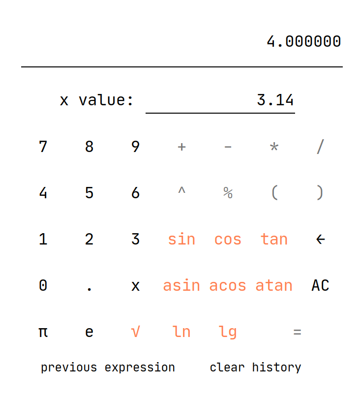
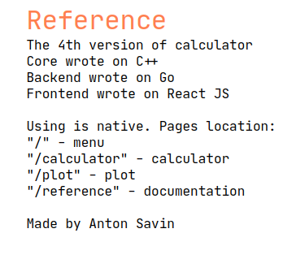

# SmartCalculation-v3.0

Implementation of a calculator with a web interface in React, a service in Golang, and calculations in C++.

## Content

This project implements a web calculator with the following capabilities:
1. Page navigation
2. Calculation of the value of a function at a point
3. Direct calculation
4. Graphing functions
5. Saving and using expression history

This project is a modification of the previous version of the calculator
[SmartCalculation-v2.0](https://github.com/sav1nbrave4code/SmartCalculation-v2.0).

What was used:
1. Frontend - `JS + React`
2. Backend - `Golang + Chi`
3. Core - `C++ + C`

All components of the project are launched in separate docker containers and combined into one layer with
using docker-compose. Accordingly, `docker` and `docker-compose` are required to run this application.

The application uses the following ports:
1. 3000 - frontend (main)
2. 8080 - backend

Frontend has the following endpoints:
1. / - home page, application navigation
2. /calculator - page with a calculator
3. /plot - page with plotting
4. /reference - help page

Backend has the following endpoints:
1. /api/calculator - calculate the value of an expression, query parameters: expression, x
2. /api/plot - calculation of function values ​​for plotting,
   query parameters: expression, begin, end
3. /api/previous_expression - returns the previous successfully evaluated expression
4. /api/clear_history - clears the history of expressions

To run the `make` application to clear the cache of the docker containers `make clean`.

Some examples of what the web interface looks like:

Home page

Calculator

Graphing

Reference

