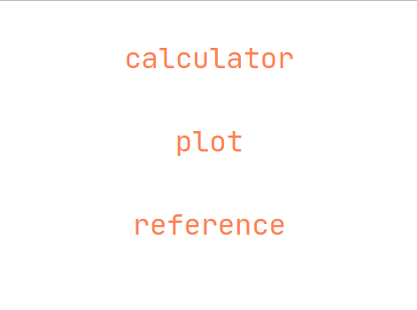
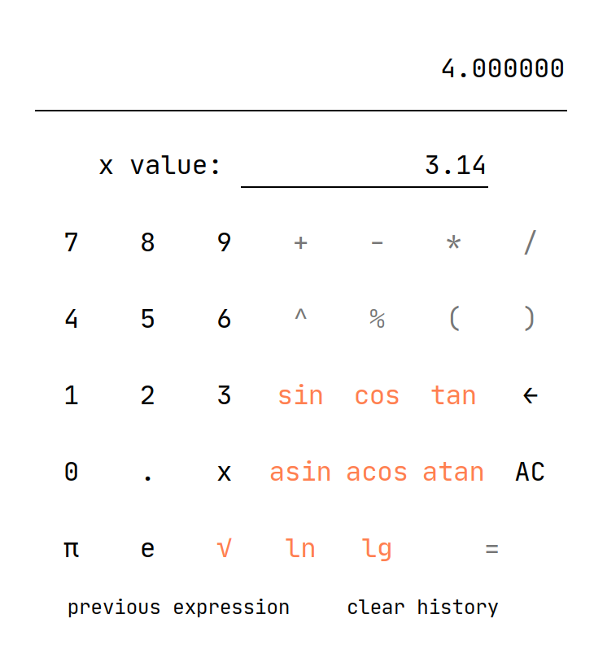
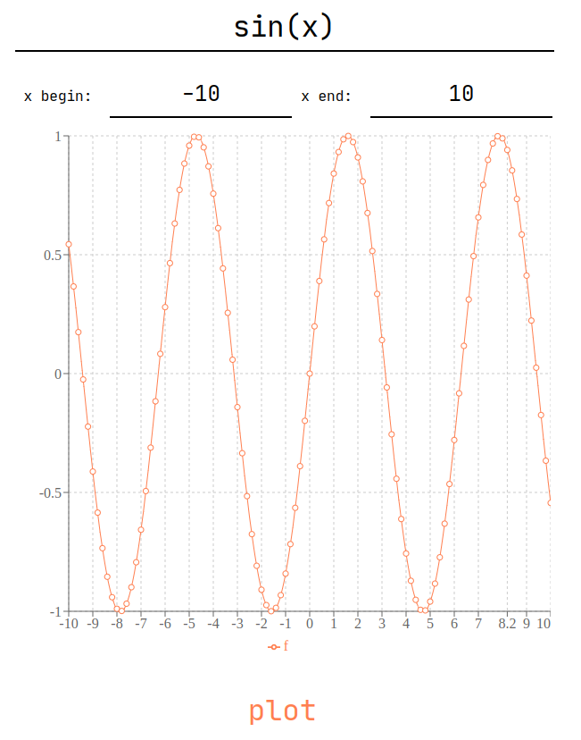
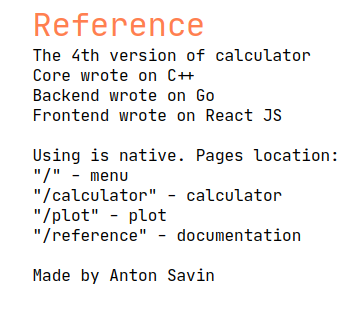

# SmartCalculation-v3.0

Реализация калькулятора с веб-интерфейсом на React, сервисом на Golang и вычислениями на C++.

## Содержание

В данном проекте реализован веб калькулятор со следующими возможностями:
1. Навигация по страницам
2. Вычисление значения функции в точке
3. Прямое вычисление
4. Построение графиков функций
5. Сохранение истории выражений и использование ее

Данный проект является модификацией предыдущей версии калькулятора
[SmartCalculation-v2.0](https://github.com/sav1nbrave4code/SmartCalculation-v2.0).

Что было использовано:
1. Frontend - `JS + React`
2. Backend - `Golang + Chi`
3. Core - `C++ + C`

Все составляющие проекта - запускаются в отдельных docker контейнерах и объединены в один слой с
помощью docker-compose. Соответственно для запуска данного приложения требуются `docker` и `docker-compose`.

Приложение использует следующие порты:
1. 3000 - frontend (main)
2. 8080 - backend

Frontend имеет следующие эндпоинты:
1. / - главная страница, навигация по приложению
2. /calculator - страница с калькулятором
3. /plot - страница с построением графиков
4. /reference - страница со справкой

Backend имеет следующие эндпоинты:
1. /api/calculator - вычисление значения выражения, параметры запроса: expression, x
2. /api/plot - вычисление значений функции для построения графиков,
параметры запроса: expression, begin, end
3. /api/previous_expression - возвращает предыдущее успешно вычисленное выражение
4. /api/clear_history - очищает историю выражений

Чтобы запустить приложение `make`, чтобы очистить кэш докер контейнеров `make clean`.

Некоторые примеры того, как выглядит веб-интерфейс:

Главная страница

Калькулятор

Построение графиков

Справка

